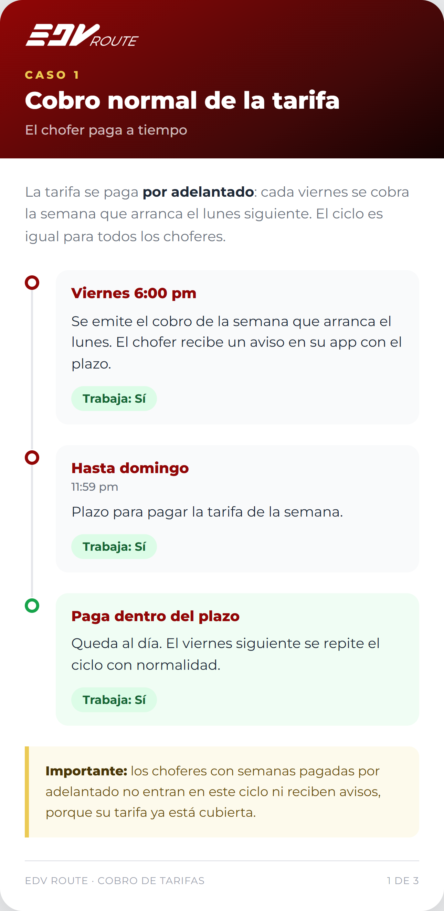
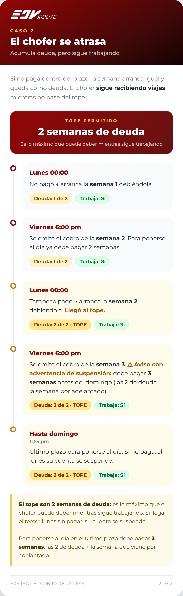
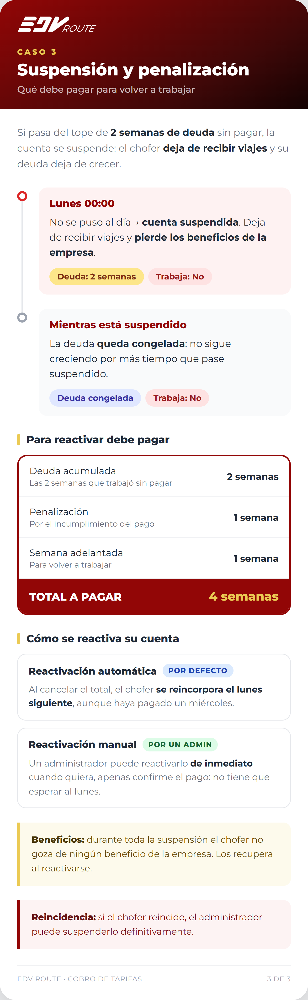

# Propuesta — Cobro de tarifas con deuda y penalización

> **ESTADO: PROPUESTA · NO IMPLEMENTADA.** Este documento describe un modelo de negocio
> pedido por la dueña que **contradice el patrón de tarifas actualmente en producción**.
> No se ha escrito código para esto. Requiere análisis de impacto y aprobación final antes
> de implementar. Fecha: 2026-07-16.
>
> 🛠️ **Análisis de impacto técnico (diseño v8, Fase B):** [analisis-impacto-v8.md](analisis-impacto-v8.md)
> — modelado de la deuda, impacto por capa, decisiones abiertas con recomendación y sub-fases.
> **Siguiente paso: cerrar las 5 decisiones** de ese documento antes de escribir código.
>
> ✅ **ACTUALIZACIÓN 2026-07-24:** modelo **cerrado formalmente** y motor implementado (B1–B3 +
> B4-dashboard) pero **apagado** (`debt_engine_enabled = false`). Las preguntas abiertas de más
> abajo quedaron resueltas — ver [analisis-impacto-v8 §3](analisis-impacto-v8.md) y el
> [decisions-log](../../decisions/decisions-log.md). El plan de migración de datos ya está diseñado
> ([plan-migracion-anclaje.md](plan-migracion-anclaje.md)); falta aprobarlo e implementarlo antes de encender.

## Por qué es una propuesta y no una decisión cerrada

El sistema **hoy** funciona con un patrón distinto (ver "Diferencias con lo implementado"
más abajo). Este modelo introduce conceptos que **no existen en la base de datos actual**
—deuda acumulada, penalización, contador implícito de semanas debidas— por lo que su
adopción es un cambio estructural, no un ajuste. Se documenta aquí para discutirlo con la
dueña y, una vez aprobado, convertirlo en el diseño oficial (v8) con su análisis de impacto.

Quedan además **preguntas abiertas** al final; sin ellas resueltas no debe implementarse.

## Resumen del modelo propuesto

La tarifa se cobra **por adelantado**: cada viernes se cobra la semana que arranca el lunes
siguiente. El día de cobro es **el mismo para todos los choferes**. Los choferes con semanas
pagadas por adelantado quedan fuera de este ciclo (su tarifa ya está cubierta y no reciben
avisos).

### Caso 1 — Cobro normal (paga a tiempo)

| Momento | Qué pasa | ¿Trabaja? |
|---|---|---|
| Viernes 6:00 pm | Se emite el cobro de la semana que arranca el lunes. Aviso en la app con el plazo. | Sí |
| Hasta domingo 11:59 pm | Plazo para pagar. | Sí |
| Paga dentro del plazo | Queda al día; el viernes siguiente se repite el ciclo. | Sí |

### Caso 2 — Se atrasa (acumula deuda, sigue trabajando)

**Tope permitido: 2 semanas de deuda.** Es lo máximo que el chofer puede deber mientras
sigue trabajando.

| Momento | Qué pasa | Deuda | ¿Trabaja? |
|---|---|---|---|
| Lunes 00:00 | No pagó → arranca la semana 1 debiéndola. | 1 de 2 | Sí |
| Viernes 6:00 pm | Se emite el cobro de la semana 2. Para ponerse al día ya debe 2 semanas. | 1 de 2 | Sí |
| Lunes 00:00 | Tampoco pagó → arranca la semana 2 debiéndola. **Llegó al tope.** | 2 de 2 · tope | Sí |
| Viernes 6:00 pm | Se emite el cobro de la semana 3. ⚠️ **Aviso con advertencia de suspensión:** debe pagar 3 semanas antes del domingo (las 2 de deuda + la adelantada). | 2 de 2 · tope | Sí |
| Hasta domingo 11:59 pm | Último plazo para ponerse al día; si no paga, el lunes se suspende. | 2 de 2 · tope | Sí |

> **Distinción clave:** el *tope de deuda* son **2 semanas** (las que trabaja sin pagar).
> Para **ponerse al día** en el último plazo paga **3 semanas** = 2 de deuda + 1 por
> adelantado (la que le permite seguir trabajando la semana siguiente).

### Caso 3 — Suspensión y penalización

Si pasa del tope sin pagar, el lunes 00:00 la **cuenta se suspende**: deja de recibir viajes
y **pierde los beneficios de la empresa**. La deuda **queda congelada** en 2 semanas (no
crece por más tiempo que pase suspendido).

**Para reactivar debe pagar 4 semanas:**

| Concepto | Semanas | Detalle |
|---|---|---|
| Deuda acumulada | 2 | Las 2 semanas que trabajó sin pagar |
| Penalización | 1 | Multa por el incumplimiento (semana que **no** trabaja) |
| Semana adelantada | 1 | La que le permite volver a trabajar |
| **Total** | **4** | |

**Reactivación — dos modos:**

- **Automática (por defecto):** tras pagar el total, el chofer se reincorpora **el lunes
  siguiente**, aunque haya pagado un miércoles. Pierde el resto de la semana en curso.
- **Manual (por un admin):** un administrador puede reactivarlo **de inmediato** apenas
  confirme el pago, sin esperar al lunes.

**Beneficios:** durante toda la suspensión el chofer no goza de ningún beneficio de la
empresa; los recupera al reactivarse.

**Reincidencia:** si el chofer reincide, el administrador puede **suspenderlo
definitivamente**. Es criterio del admin (no un contador automático) y se ejecuta con la
suspensión administrativa que ya existe; se decide de manera externa a la aplicación.

## Diferencias con lo implementado (el delta a construir)

| Tema | Hoy (en producción) | Propuesta |
|---|---|---|
| Al vencer la tarifa | Suspensión **inmediata** (`grace = 0`); sin deuda | Sigue trabajando hasta **2 semanas de deuda** |
| Concepto de "deuda" | No existe (prepago puro) | **Nuevo**: deuda acumulada que se debe saldar |
| Concepto de "penalización" | No existe | **Nuevo**: 1 semana extra de multa |
| Reactivación al pagar | Inmediata y automática | El lunes siguiente (auto) o inmediata (manual) |
| Reincidencia | No existe | Suspensión definitiva a criterio del admin |
| Estado de tarifa vs administrativo | Ya están separados ✅ | Se aprovecha tal cual (el pago no levanta una suspensión administrativa) |

> Lo único que **ya está a favor**: la arquitectura separa el estado de la tarifa del estado
> administrativo del chofer, y la suspensión/reembolso con rastro ya existen. El resto
> (deuda, penalización, ventana de tope, reactivación diferida al lunes) es nuevo.

## Preguntas abiertas (resolver antes de implementar)

1. **Pausa voluntaria** (el chofer pausa su cuenta): ¿se le deja de cobrar mientras está en
   pausa? ¿puede reactivarse cuando quiera o hay un límite? ¿conserva los beneficios?
2. **Suspensión definitiva y membresía**: al suspender definitivamente a un reincidente,
   ¿qué pasa con su membresía (pago único vitalicio ya cobrado)? ¿se devuelve, se pierde o
   queda congelada por si vuelve?
3. **Hora exacta del cobro**: las imágenes usan "viernes 6:00 pm"; confirmar contra la
   configuración real (`business_timezone`, hoy los vencimientos son a las 00:00).

## Parámetros que deberían ser configurables (`app_settings`)

La dueña cambia de modelo con frecuencia; para no reprogramar en cada ajuste, al implementar
esto conviene exponer como configuración: tope de semanas de deuda (2), semanas de
penalización (1), modo de reactivación por defecto (automática/manual), día y hora de cobro.

## Fuentes

- Imágenes en alta resolución (formato teléfono): `caso-1`, `caso-2`, `caso-3` (PNG).
- Fuente editable: [`flujo-tarifas.html`](flujo-tarifas.html) — editar y regenerar los PNG
  cuando el modelo cambie.
